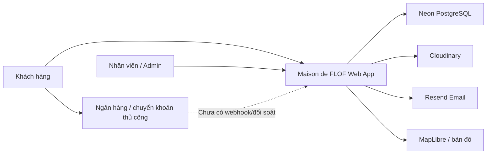
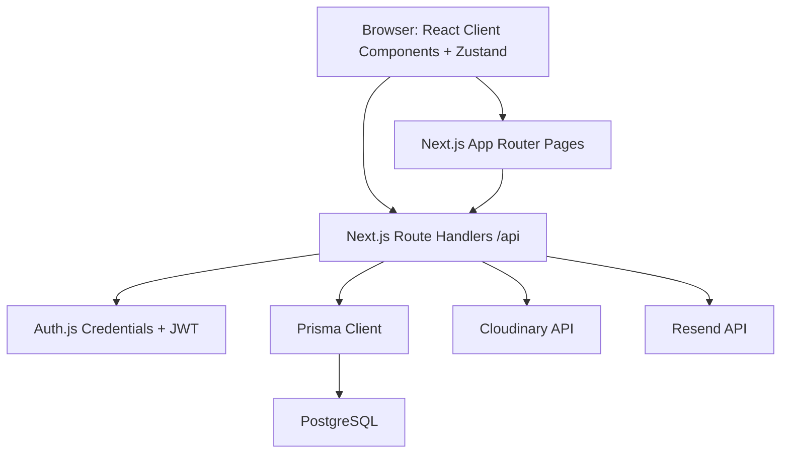
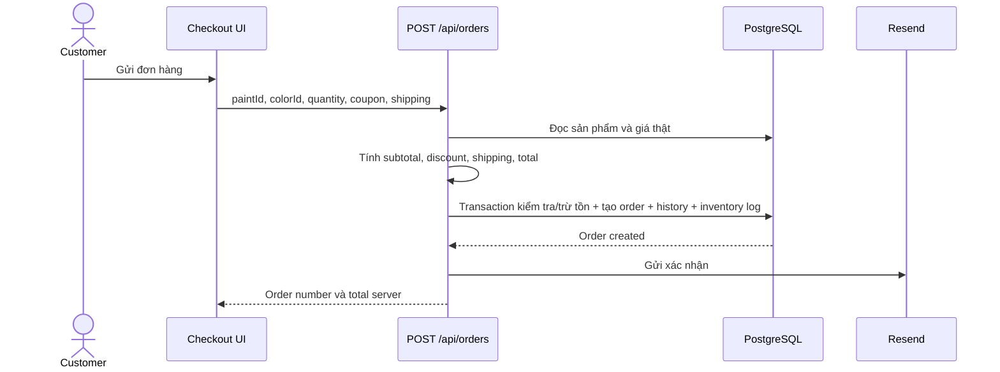

# Báo cáo phân tích toàn diện dự án Maison de FLOF

Ngày đánh giá: 11/06/2026  
Phạm vi: Toàn bộ repository `D:\ProjectZ\FLOF`  
Phương pháp: đọc mã nguồn, schema và migration; truy vết luồng nghiệp vụ; kiểm tra cấu hình; chạy quality gate và dependency audit.

## Cập nhật triển khai sau audit

Các hạng mục sau đã được triển khai trong repository sau khi báo cáo ban đầu được lập:

- Thêm payment lifecycle cho COD/chuyển khoản, gồm `PENDING`, `PAID`, `CANCELLED`, `REFUNDED` và đối soát/hoàn tiền thủ công.
- Thêm checkout idempotency bằng `Idempotency-Key`.
- Sửa race condition cập nhật trạng thái đơn bằng conditional update trong transaction.
- Chặn xử lý đơn chuyển khoản chưa thanh toán và chặn hủy đơn đã thanh toán trước khi hoàn tiền.
- Thêm permission policy; Staff không còn được mutation catalog, coupon, promotion hoặc xóa media.
- Thêm `AuditLog` và ghi log cho order status, payment, inventory, product, coupon và media deletion.
- Chặn sửa tồn kho trực tiếp qua product update.
- Nâng `next-auth` từ beta.25 lên beta.31; advisory trực tiếp của Auth.js đã được xử lý.
- Tăng test tự động từ 6 lên 11 trường hợp và thêm dependency audit mức high vào CI.

Migration cần được áp dụng trước khi chạy phiên bản mới:

```text
npm run db:migrate
```

Hai advisory moderate còn lại thuộc PostCSS được pin bên trong Next.js 15.5.19; không áp dụng đề xuất `npm audit fix --force` vì npm đề xuất hạ Next.js xuống phiên bản không phù hợp.

## 1. Tóm tắt điều hành

Maison de FLOF là nền tảng thương mại điện tử và tư vấn sơn B2C, đồng thời có cổng quản trị cho nhân viên và quản trị viên. Dự án đã vượt qua giai đoạn prototype và đang ở mức **functional MVP tương đối hoàn chỉnh**:

- Storefront có danh mục, chi tiết sản phẩm, bảng màu, phối màu, tính sơn, đại lý, blog, giỏ hàng và checkout.
- Tài khoản khách hàng có hồ sơ, địa chỉ, yêu thích, lịch sử đơn và đánh giá.
- Admin có dashboard, đơn hàng, hóa đơn, sản phẩm, kho, màu, danh mục, nhà cung cấp, đại lý, bài viết, media, coupon, báo giá, chat, review và tài khoản.
- Dữ liệu nghiệp vụ chính đã chuyển sang PostgreSQL/Prisma.
- Checkout đã tính giá lại phía server, kiểm tra tồn kho, trừ kho và tạo đơn trong transaction.
- Role guard, Zod validation, migration, CI và một số security header đã tồn tại.
- `npm run check` chạy thành công: lint, typecheck, 6 test và production build đều đạt.

Tuy nhiên, dự án **chưa nên phát hành như một hệ thống thương mại điện tử production có giao dịch thật** trước khi xử lý các rủi ro chính:

1. Chuyển khoản ngân hàng được mô tả là tự động nhưng hệ thống không có payment record, webhook hay đối soát.
2. Cập nhật trạng thái đơn hàng có race condition, có thể hoàn kho hoặc cộng doanh thu nhiều lần khi request đồng thời.
3. Checkout chưa có idempotency key, retry có thể tạo đơn trùng.
4. `STAFF` có quyền thay đổi gần như toàn bộ dữ liệu vận hành, chưa có ma trận quyền chi tiết và audit log.
5. Test mới chỉ bao phủ 6 trường hợp hàm thuần; chưa có integration/E2E cho checkout, tồn kho và authorization.
6. Chưa có observability, SLO, cảnh báo, runbook, backup/restore drill và quy trình incident.
7. Dependency audit có 3 cảnh báo moderate, gồm advisory cho phiên bản `next-auth` beta hiện tại.

### Kết luận phát hành

| Mục tiêu phát hành | Đánh giá |
|---|---|
| Demo, đồ án, showcase nội bộ | Đạt |
| UAT/staging với dữ liệu thử nghiệm | Đạt có điều kiện |
| Production nhận đơn COD quy mô nhỏ | Chưa đạt, cần xử lý P0/P1 |
| Production nhận chuyển khoản thật | Không đạt |
| Production có SLA và vận hành dài hạn | Không đạt |

### Điểm trưởng thành hiện tại

| Lĩnh vực | Điểm / 10 | Nhận định |
|---|---:|---|
| Tầm nhìn và phạm vi nghiệp vụ | 7.5 | Phạm vi sản phẩm rõ, bao phủ hành trình mua sơn |
| Độ hoàn thiện chức năng | 8.0 | Nhiều module đã hoạt động với database thật |
| UX/UI và accessibility | 7.0 | Giao diện phong phú, responsive; chưa kiểm chứng WCAG |
| Kiến trúc ứng dụng | 6.5 | Cấu trúc rõ nhưng page lớn, client-heavy, thiếu service layer |
| Dữ liệu và tính toàn vẹn | 7.0 | Schema tốt, checkout transaction-safe; còn race condition và thiếu payment |
| Bảo mật | 5.5 | Có auth/role/validation; thiếu hardening và dependency remediation |
| Kiểm thử | 3.0 | Quality gate tốt nhưng độ phủ test rất thấp |
| CI/CD và vận hành | 4.5 | Có CI; thiếu deploy pipeline, monitoring, SLO và runbook |
| Tài liệu | 6.5 | README và roadmap tốt nhưng roadmap đã lỗi thời một phần |
| **Tổng thể** | **6.3** | **Functional MVP, chưa production-ready** |

---

## 2. Bối cảnh và mục tiêu sản phẩm

### 2.1 Bài toán kinh doanh được suy luận từ hệ thống

Maison de FLOF hướng tới số hóa hành trình mua và tư vấn sơn:

- Giúp khách hàng khám phá sản phẩm và màu sơn phù hợp.
- Giảm khó khăn khi ước lượng lượng sơn cần mua.
- Tăng khả năng chuyển đổi từ cảm hứng màu sắc sang giỏ hàng hoặc yêu cầu báo giá.
- Kết nối khách hàng với đại lý gần nhất.
- Cho phép đội vận hành quản lý đơn, tồn kho, nội dung, màu, đại lý và khách hàng trên cùng hệ thống.

### 2.2 Nhóm người dùng

| Persona | Mục tiêu chính | Chức năng hiện có |
|---|---|---|
| Khách chưa đăng nhập | Tìm hiểu sản phẩm, màu, đại lý, nội dung | Đầy đủ |
| Khách hàng | Lưu yêu thích, đặt hàng, theo dõi đơn, đánh giá | Đầy đủ phần lớn |
| Nhân viên `STAFF` | Xử lý đơn, kho, báo giá, chat, catalog | Có, nhưng quyền quá rộng |
| Quản trị viên `ADMIN` | Quản trị tài khoản và toàn hệ thống | Có |
| Nhà thầu/doanh nghiệp | Yêu cầu báo giá dự án | Có form cơ bản |

### 2.3 Giá trị khác biệt

- Kết hợp commerce với bảng màu và visualizer.
- Có paint calculator gắn với thông số coverage.
- Có dealer locator bằng MapLibre.
- Có hệ thống nội dung và tư vấn thay vì chỉ là catalog bán hàng.

### 2.4 KPI nên được định nghĩa

Repository chưa có tài liệu KPI chính thức. Các KPI nên được chốt:

| Nhóm | KPI đề xuất |
|---|---|
| Acquisition | Organic traffic, tỷ lệ vào trang sản phẩm từ blog/màu |
| Engagement | Số lượt dùng visualizer, calculator, lưu màu |
| Conversion | Add-to-cart rate, checkout completion, quote conversion |
| Commerce | GMV, AOV, tỷ lệ hủy đơn, tỷ lệ thiếu tồn |
| Operations | Thời gian xử lý đơn, quote SLA, inventory variance |
| Reliability | Availability, error rate, p95 latency, MTTR |
| Experience | LCP, INP, CLS, task completion, accessibility score |

---

## 3. Phạm vi hệ thống hiện tại

### 3.1 Quy mô repository

| Chỉ số | Giá trị |
|---|---:|
| Trang `page.tsx` | 31 |
| API route handlers | 38 |
| Prisma models | 26 |
| TypeScript/TSX/Prisma/SQL files được thống kê | 130 |
| Dòng mã ước tính | Khoảng 21.000 |
| Migration | 5 |
| Unit tests | 6 test cases |
| Production routes sau build | 67 |
| File có gọi `fetch()` | 30 |
| File còn tham chiếu `localStorage` | 2 |
| File còn import `mock-data` | 6, chủ yếu làm kiểu dữ liệu/legacy coupling |

### 3.2 Module storefront

- Homepage.
- Products và product detail.
- Colors và color detail drawer.
- Color visualizer.
- Paint calculator.
- Find dealer.
- Blog và blog detail.
- Cart.
- Checkout COD/chuyển khoản.
- Login/register.
- Quote request.
- Chat hỗ trợ.
- Profile, địa chỉ, favorites, đơn hàng, đổi mật khẩu.
- Review sản phẩm.

### 3.3 Module admin

- Dashboard.
- Orders và invoices.
- Quotes và chat.
- Products, promotion và inventory import.
- Categories và suppliers.
- Colors và collections.
- Articles.
- Media/Cloudinary.
- Reviews.
- Dealers.
- Coupons.
- Accounts và roles.

---

## 4. Kiến trúc hệ thống hiện tại

### 4.1 Stack

| Lớp | Công nghệ |
|---|---|
| Web framework | Next.js 15.5.19 App Router |
| UI | React 19, TailwindCSS, Framer Motion |
| Client state | Zustand |
| Query provider | TanStack React Query, hiện gần như chưa được sử dụng |
| Form/validation | Zod; React Hook Form được cài nhưng ít dùng |
| Authentication | Auth.js/NextAuth v5 beta, Credentials, JWT session |
| Database | PostgreSQL/Neon |
| ORM | Prisma 6 |
| Media | Cloudinary |
| Email | Resend |
| Maps | MapLibre GL |
| Charts | Chart.js |
| CI | GitHub Actions |

### 4.2 System context



### 4.3 Container view



### 4.4 Điểm mạnh kiến trúc

- Một codebase full-stack giúp MVP phát triển nhanh.
- Route handlers có Zod validation khá nhất quán ở các mutation.
- Helper `requireUser`, `requireStaff`, `requireAdmin` tạo baseline authorization tốt.
- Checkout và cập nhật tồn kho dùng Prisma transaction.
- Dữ liệu order item và shipping có snapshot, tránh phụ thuộc hoàn toàn vào dữ liệu hiện tại.
- Có migration thay vì dùng `db push` trên production.
- Public API có cache header cho một số catalog.
- Có sitemap và robots động.

### 4.5 Điểm yếu kiến trúc

- Business logic nằm trực tiếp trong route handlers; chưa có service layer rõ ràng.
- Nhiều page client quá lớn và chứa cả fetch, state, mapping DTO, business behavior và UI.
- Dữ liệu được fetch thủ công bằng `useEffect`; React Query provider có nhưng không được tận dụng.
- Nhiều public page render dữ liệu sau hydration, giảm lợi ích Server Components, SEO và cache.
- Kiểu dữ liệu frontend còn phụ thuộc `mock-data` và có 56 lần dùng `any`.
- Chưa có API versioning hoặc contract OpenAPI.
- Chưa có event/outbox cho email và side effect.
- Chưa có background jobs.
- Chưa có audit trail chung.

### 4.6 Các file cần tách nhỏ

| File | Dòng xấp xỉ | Rủi ro |
|---|---:|---|
| `src/app/page.tsx` | 1.566 | Homepage khó bảo trì và test |
| `src/app/admin/paints/page.tsx` | 951 | CRUD, promotion và UI trộn lẫn |
| `src/app/profile/page.tsx` | 853 | Nhiều domain trong một page |
| `src/app/products/[slug]/page.tsx` | 691 | Product detail, favorites, cart, review trộn lẫn |
| `src/app/checkout/page.tsx` | 567 | Checkout form và confirmation trong một component |
| `src/app/admin/dealers/page.tsx` | 566 | Form, map và CRUD trong một page |

---

## 5. Phân tích yêu cầu chức năng

### 5.1 Ma trận chức năng

| Mã | Chức năng | Hiện trạng | Đánh giá |
|---|---|---|---|
| FR-001 | Đăng ký bằng email/mật khẩu | Có | Thiếu verify email |
| FR-002 | Đăng nhập và phân quyền | Có | Role baseline tốt |
| FR-003 | Quản lý hồ sơ và đổi mật khẩu | Có | Thiếu password reset |
| FR-004 | CRUD địa chỉ | Có | Có kiểm tra ownership |
| FR-005 | Xem/lọc sản phẩm | Có | API chưa pagination/filter server-side |
| FR-006 | Xem chi tiết sản phẩm và màu | Có | Client-heavy |
| FR-007 | Giỏ hàng | Có | Lưu local là phù hợp cho cart tạm |
| FR-008 | Coupon | Có | Final discount được xác nhận server |
| FR-009 | Checkout | Có | Thiếu idempotency và payment processing |
| FR-010 | Tồn kho | Có | Có transaction, nhưng có đường bypass ledger |
| FR-011 | Theo dõi trạng thái đơn | Có | Có history |
| FR-012 | Hủy/hoàn kho | Có | Có race condition |
| FR-013 | Yêu thích màu/sản phẩm | Có | Colors vẫn có local fallback |
| FR-014 | Review đã mua | Có | Không có trạng thái moderation |
| FR-015 | Paint calculator | Có | Logic cơ bản, chưa tối ưu quy cách lon |
| FR-016 | Color visualizer | Có | Dùng ảnh preset, chưa phải AI |
| FR-017 | Dealer locator | Có | Không có tìm gần nhất server-side |
| FR-018 | Blog | Có | Category/read time đang hard-code |
| FR-019 | Quote request | Có | Chưa có notification/SLA/assignment |
| FR-020 | Chat request | Có | Có notification DB cho staff |
| FR-021 | Admin CRUD catalog | Có | Staff được quyền rộng |
| FR-022 | Admin media | Có | Chưa có MediaAsset trong DB |
| FR-023 | Admin dashboard | Có | Một số metric chưa chính xác |
| FR-024 | Hóa đơn | Có | Là bản hiển thị/in, chưa phải e-invoice |
| FR-025 | Chuyển khoản | Mô phỏng | Không có payment lifecycle |

### 5.2 Luồng commerce hiện tại



Luồng này có nền tảng tốt vì không tin giá từ client. Phần cần bổ sung là idempotency, payment state, retry side effect và concurrency control cho cập nhật trạng thái.

---

## 6. Phân tích dữ liệu

### 6.1 Domain model

Các nhóm model chính:

- Identity: `Role`, `User`, `Account`, `Session`, `VerificationToken`, `Customer`, `Address`.
- Catalog: `Category`, `Supplier`, `Paint`, `PaintColor`, `ColorCollection`, `PaintColorLink`.
- Commerce: `Order`, `OrderItem`, `OrderStatusHistory`, `Coupon`, `InventoryTransaction`.
- Engagement: `Wishlist`, `WishlistColor`, `Review`, `Notification`, `Blog`.
- Service: `Dealer`, `QuoteRequest`, `ChatMessage`.

### 6.2 Điểm mạnh dữ liệu

- Quan hệ người dùng, customer và address tương đối rõ.
- Catalog có category, supplier, màu và collection.
- Order lưu snapshot tên sản phẩm, SKU, màu và shipping.
- Có unique review theo `paintId + userId`.
- Có index cho nhiều trường truy vấn phổ biến.
- Inventory log tồn tại cho checkout, cancel và import.
- Migration baseline và migration gia tăng đã có.

### 6.3 Khoảng trống dữ liệu

| Khoảng trống | Tác động |
|---|---|
| Không có `Payment`/`PaymentTransaction` | Không thể đối soát hoặc xác định trạng thái chuyển khoản |
| `paymentMethod` là chuỗi tự do | Không có enum/status/reference rõ ràng |
| `OrderItem.colorId` không có relation tới `PaintColor` | Khó đảm bảo tham chiếu và query |
| Không có `AuditLog` | Không biết ai thay đổi catalog, coupon, media, tồn kho |
| Không có `MediaAsset` | Media tồn tại ngoài DB, thiếu alt text/ownership/reference |
| Quote không có assignee, SLA, history | Khó vận hành đội sales |
| Notification chưa có API/UI đầy đủ | Model tồn tại nhưng giá trị vận hành hạn chế |
| Review không có moderation state | Nội dung được public ngay |
| Coupon không có per-user usage history | Một khách có thể dùng lặp đến giới hạn tổng |
| Không có idempotency record | Khó chống tạo đơn trùng |

### 6.4 Các vấn đề toàn vẹn dữ liệu

1. `PATCH /api/orders/[orderNumber]` đọc trạng thái trước transaction. Hai request đồng thời có thể cùng hoàn kho hoặc cùng cộng `totalSpent`.
2. `PATCH /api/admin/products` cho phép sửa trực tiếp `stock` nhưng không tạo `InventoryTransaction`, làm ledger lệch thực tế.
3. Seed dealer dùng `create` thay vì `upsert`, chạy seed nhiều lần tạo bản ghi trùng.
4. Dashboard low-stock dùng `stock <= 5`, bỏ qua `minStock` từng sản phẩm.
5. Dashboard best-seller revenue dùng `soldCount * current price`, không dùng doanh thu snapshot thực tế.

---

## 7. Phân tích API

### 7.1 Điểm tốt

- Mutation API phần lớn dùng Zod.
- Admin API kiểm tra role phía server.
- Profile/address/favorite kiểm tra ownership.
- Order list chỉ cho customer xem đơn của chính họ; staff có thể xem toàn bộ.
- Review chỉ cho người có đơn `COMPLETED`.
- API error helper xử lý lỗi Prisma phổ biến.
- Public catalog không trả cost price.

### 7.2 Khoảng trống

- Public list API trả toàn bộ products/colors/blogs/dealers, không pagination.
- Không có OpenAPI/contract test.
- Error response chưa có `requestId`, error code ổn định hoặc tracing.
- Public quote/chat/register dễ bị abuse; rate limiter hiện không đủ tin cậy trên serverless.
- Email thất bại chỉ `console.error` và vẫn trả nghiệp vụ thành công, không có retry/outbox.
- Media upload dùng data URL lớn qua JSON, gây overhead bộ nhớ và request size.
- Không có idempotency cho checkout.
- Không có optimistic concurrency/version field.

---

## 8. UX/UI, accessibility và SEO

### 8.1 Điểm mạnh UX

- Hành trình khám phá sản phẩm phong phú.
- Có responsive navigation, mobile admin menu và loading states.
- Cart và checkout có summary rõ ràng.
- Có empty/loading/error state ở nhiều module.
- Hầu hết ảnh có `alt`.
- Một số control có `aria-label`, keyboard handling và semantic role.
- VI/EN được hỗ trợ ở nhiều phần giao diện.

### 8.2 Vấn đề UX

- Chuyển khoản hiển thị thông điệp “tự động kích hoạt” nhưng không có chức năng tương ứng.
- Một số trang rất dài và nhiều hiệu ứng, có thể gây quá tải nhận thức hoặc giảm hiệu năng mobile.
- Header chỉ hiện link admin cho `ADMIN`, không hiện cho `STAFF` dù staff được phép truy cập.
- Ngôn ngữ dùng client state, nhưng `<html lang="vi">` luôn cố định; không phản ánh EN cho screen reader/SEO.
- Nội dung và dữ liệu fallback VI/EN chưa nhất quán.
- Color visualizer là preset render nhưng copy có thể khiến người dùng hiểu là AI/simulation chính xác.

### 8.3 Accessibility

Chưa có bằng chứng kiểm thử WCAG 2.2 AA. Các rủi ro:

- Chưa có automated accessibility test.
- Modal/menu tự xây cần kiểm tra focus trap, Escape và focus return.
- Nhiều text rất nhỏ `9px-11px`.
- Cần kiểm tra contrast trên nền ảnh/glassmorphism.
- Cần kiểm tra reduced motion với Framer Motion.
- Cần kiểm tra toàn bộ luồng chỉ dùng bàn phím và screen reader.

### 8.4 SEO và performance

Điểm tốt:

- Có metadata global, robots và sitemap động.
- Có cache header cho một số public API.
- Next Image được dùng rộng rãi.

Khoảng trống:

- Không thấy `generateMetadata` riêng cho product/blog detail.
- Không thấy structured data Product/Article/Breadcrumb.
- Nhiều trang public là client component và fetch sau hydration.
- Public catalog API không pagination.
- Shared first-load JS là 103 kB; một số route lớn:
  - `/admin`: 224 kB.
  - `/products`: 196 kB.
  - `/admin/paints`: 194 kB.
  - `/colors`: 190 kB.
  - `/find-dealer`: 192 kB.
- Chưa có đo Core Web Vitals thực tế hoặc performance budget.

---

## 9. Bảo mật

### 9.1 Biện pháp đã có

- Password được hash bằng bcrypt cost 12.
- Credentials authorization kiểm tra password hash.
- JWT session và middleware bảo vệ `/admin`, `/profile`.
- Server-side role guard cho API.
- Zod validation cho mutation quan trọng.
- Checkout không tin giá từ client.
- Security header: `nosniff`, `SAMEORIGIN`, Referrer Policy, Permissions Policy.
- `.env` bị ignore và không được track.
- Production seed bị chặn mặc định.
- Email HTML có escape.
- Media delete giới hạn prefix `flof/`.

### 9.2 Phát hiện bảo mật

#### P0/P1

1. **Dependency advisory:** `npm audit --omit=dev` báo 3 moderate vulnerabilities. `next-auth 5.0.0-beta.25` nằm trong advisory email misdelivery và có bản fix beta.31.
2. **Rate limiter không phù hợp serverless:** lưu trong memory, không chia sẻ giữa instance và có thể reset khi cold start.
3. **IP key có thể không đáng tin:** dùng trực tiếp `x-forwarded-for`; cần lấy IP theo chuẩn trusted proxy/platform.
4. **Thiếu CSP và HSTS:** security headers chưa có Content-Security-Policy và Strict-Transport-Security.
5. **Không có email verification/password reset/MFA cho admin.**
6. **Seed chứa mật khẩu demo cố định:** an toàn cho local nếu kiểm soát, nhưng nguy hiểm nếu seed nhầm môi trường.
7. **STAFF có quyền rộng:** có thể sửa/xóa mềm catalog, coupon, media, nội dung và dữ liệu vận hành.
8. **Không có audit log cho hành động admin.**

#### P2

- Media upload chấp nhận mọi `data:image/*`; cần whitelist MIME, kiểm tra magic bytes và transformation.
- Public forms cần anti-bot/rate limit dùng shared store.
- Password policy chỉ yêu cầu tối thiểu 8 ký tự.
- Session token role chỉ cập nhật khi đăng nhập; thay đổi role có thể không có hiệu lực ngay với session hiện tại.
- Chưa có security test tự động hoặc pentest checklist.

### 9.3 Đối chiếu OWASP ASVS ở mức khái quát

| Nhóm | Hiện trạng |
|---|---|
| Authentication | Có baseline, thiếu verification/reset/MFA/lockout production |
| Session | JWT baseline, cần review rotation/revocation |
| Access control | Có guard, thiếu granular RBAC và audit |
| Validation | Tốt ở mutation, cần chuẩn hóa toàn bộ |
| Stored cryptography | Password hash tốt; chưa có phân loại dữ liệu |
| Error/logging | Không lộ stack cho client; thiếu centralized logging |
| Data protection | Chưa có retention, deletion và privacy policy |
| Files/resources | Có giới hạn sơ bộ; cần MIME/content validation |
| API/web services | Thiếu idempotency, rate limit shared, contract test |
| Configuration | Có env example; thiếu secret rotation và production hardening |

---

## 10. Kiểm thử và chất lượng

### 10.1 Kết quả kiểm chứng ngày 11/06/2026

Lệnh đã chạy:

```text
npm run check
```

Kết quả:

- ESLint: đạt.
- TypeScript strict/typecheck: đạt.
- Unit test: 6/6 đạt.
- Production build: đạt.
- Static generation: 67 route/page.

Dependency audit:

```text
npm audit --omit=dev --json
```

Kết quả:

- 0 critical.
- 0 high.
- 3 moderate.
- Advisory trực tiếp trên `next-auth`; advisory gián tiếp qua PostCSS/Next.

### 10.2 Độ phủ hiện tại

Test hiện tại chỉ kiểm tra:

- Coupon discount.
- Coupon availability.
- Shipping fee.
- Order transition helper.
- Paint calculator.
- Checkout schema invalid input.

Chưa có test cho:

- Đăng ký/đăng nhập/role.
- Checkout transaction và concurrent stock.
- Coupon race.
- Cancel/complete concurrent requests.
- Admin CRUD.
- Ownership của profile/address/favorites/orders.
- Upload media.
- Quote/chat/review.
- UI/E2E.
- Accessibility.
- Performance/load.
- Backup/restore.

### 10.3 Test strategy bắt buộc trước production

| Lớp | Test cần bổ sung |
|---|---|
| Unit | Pricing, status transition, DTO serialization, validators |
| Integration | Auth, RBAC, checkout transaction, cancel, coupon, inventory |
| Concurrency | Hai checkout cùng tồn kho; hai cancel/complete cùng lúc |
| E2E | Register -> cart -> checkout -> profile -> admin xử lý |
| Security | IDOR, role escalation, brute force, upload abuse |
| Accessibility | axe + keyboard + screen reader smoke |
| Performance | Catalog, product detail, checkout, dashboard |
| Recovery | Migration, backup restore, rollback |

---

## 11. CI/CD và vận hành

### 11.1 Hiện trạng

- GitHub Actions chạy `npm ci`, Prisma generate, lint, typecheck, test và build.
- README mô tả migration deploy.
- `.env.example` tương đối đầy đủ.
- Có migration và guard chống production seed ngoài ý muốn.

### 11.2 Khoảng trống

- Chưa có workflow deploy staging/production.
- Chưa có preview/UAT gate được mô tả.
- Chưa có kiểm tra migration trên database test.
- Chưa có dependency/security scan trong CI.
- Chưa có error tracking, centralized logs, metrics hoặc tracing.
- Chưa có uptime monitoring và alert.
- Chưa có SLI/SLO/SLA.
- Chưa có runbook deploy, rollback, incident và disaster recovery.
- Chưa có bằng chứng backup/restore drill.
- Chưa có feature flags/canary.

### 11.3 SLO đề xuất

| SLI | SLO ban đầu |
|---|---|
| Availability storefront | 99.9% tháng |
| Availability checkout | 99.9% tháng |
| API error rate | < 1% |
| p95 catalog API | < 500 ms |
| p95 checkout API | < 1.5 s, không tính email |
| Order duplication | 0 |
| Negative stock | 0 |
| Quote first response | < 4 giờ làm việc |
| RPO | <= 15 phút |
| RTO | <= 2 giờ |

---

## 12. Risk register

| ID | Rủi ro | Mức | Khả năng | Tác động | Biện pháp |
|---|---|---|---|---|---|
| R-01 | Chuyển khoản không có đối soát nhưng UI nói tự động | Critical | Cao | Sai trạng thái thanh toán, khiếu nại | Payment model + webhook/manual reconciliation |
| R-02 | Concurrent cancel/complete làm lệch kho/doanh thu | Critical | Trung bình | Mất toàn vẹn dữ liệu | Conditional update/version/transaction lock |
| R-03 | Checkout retry tạo đơn trùng | High | Trung bình | Đơn trùng, trừ kho hai lần | Idempotency key |
| R-04 | Staff có quyền thay đổi quá rộng | High | Trung bình | Sai/xóa dữ liệu | Permission matrix + granular guard |
| R-05 | Không có audit log | High | Cao | Không điều tra được sự cố | AuditLog immutable |
| R-06 | Test commerce/authorization quá ít | High | Cao | Regression production | Integration + E2E + concurrency tests |
| R-07 | Rate limiter memory | High | Cao trên serverless | Abuse/brute force | Redis/Upstash limiter |
| R-08 | Dependency vulnerabilities | Medium | Cao | Security exposure | Nâng phiên bản và audit CI |
| R-09 | Sửa stock qua product API bỏ qua ledger | High | Trung bình | Inventory mismatch | Chỉ sửa qua inventory service |
| R-10 | Không có observability | High | Cao | Phát hiện sự cố chậm | Logs, metrics, tracing, alerts |
| R-11 | Public list API không pagination | Medium | Tăng theo dữ liệu | Chậm/chi phí cao | Pagination/filter server-side |
| R-12 | Client-heavy và page lớn | Medium | Cao | UX/SEO kém | Server Components + split feature |
| R-13 | Seed tạo dealer trùng | Medium | Cao khi seed lại | Dữ liệu bẩn | Upsert theo khóa ổn định |
| R-14 | Email lỗi bị nuốt | Medium | Trung bình | Khách không nhận thông báo | Outbox/retry/status |
| R-15 | Không có WCAG verification | Medium | Trung bình | Khó sử dụng/pháp lý | Accessibility audit |

---

## 13. Các phát hiện ưu tiên

### P0 - Chặn production commerce

1. Xây payment lifecycle thật:
   - `Payment` model.
   - `PENDING/PAID/FAILED/REFUNDED`.
   - Bank transaction reference.
   - Webhook hoặc màn hình đối soát thủ công.
   - Chỉ dùng thông điệp “tự động” khi đã có automation thật.
2. Sửa race condition cập nhật trạng thái đơn:
   - Conditional update theo `id + currentStatus`.
   - Hoặc optimistic version field.
   - Đảm bảo cancel/complete chỉ side-effect đúng một lần.
3. Thêm idempotency cho checkout:
   - Client gửi idempotency key.
   - Server lưu key và trả lại order cũ khi retry.
4. Chặn sửa stock trực tiếp qua product CRUD; mọi thay đổi phải qua inventory transaction.
5. Bổ sung integration/E2E/concurrency tests cho commerce và authorization.

### P1 - Bắt buộc trước go-live nghiêm túc

1. Thiết kế ma trận quyền `STAFF`/`ADMIN`.
2. Thêm `AuditLog`.
3. Nâng `next-auth` khỏi beta.25 theo advisory; xử lý dependency audit.
4. Thay in-memory rate limiter bằng shared limiter.
5. Thêm monitoring, error tracking, alert và request ID.
6. Thêm email outbox/retry.
7. Thêm pagination/filter/sort cho public và admin list API.
8. Bổ sung payment/quote/inventory operational dashboards.
9. Sửa seed idempotent và tách demo credentials khỏi tài liệu production.
10. Bổ sung CSP, HSTS và security review.

### P2 - Nâng chất lượng và khả năng mở rộng

1. Chuyển public catalog/blog detail sang Server Components.
2. Thêm dynamic metadata và structured data.
3. Tách các page lớn thành feature components/hooks/services.
4. Dùng React Query thực sự hoặc bỏ dependency/provider nếu không cần.
5. Loại bỏ `mock-data` khỏi type contract; tạo DTO chung.
6. Giảm `any`, sinh type từ Zod/Prisma DTO.
7. Thêm MediaAsset, review moderation, quote assignment/history.
8. Accessibility audit WCAG 2.2 AA.
9. Đo và tối ưu Core Web Vitals thực tế.

---

## 14. Kiến trúc mục tiêu đề xuất

```text
src/
  app/
    api/                    # Route handlers mỏng
  features/
    catalog/
    checkout/
    orders/
    inventory/
    payments/
    quotes/
    identity/
  server/
    auth/                   # permission helpers
    services/               # transaction và business rules
    repositories/           # query phức tạp khi cần
    validations/            # Zod contracts
    observability/          # logger, metrics, tracing
    jobs/                   # email/outbox/reconciliation
  shared/
    dto/
    ui/
    utils/
```

Nguyên tắc:

- Route handler chỉ xác thực, validate, gọi service và trả response.
- Service sở hữu transaction và business invariants.
- Mọi thay đổi tồn kho đi qua inventory service.
- Mọi side effect quan trọng đi qua outbox/job.
- Mọi mutation nhạy cảm tạo audit log.
- Public read-heavy page ưu tiên Server Component/cache.
- Client state chỉ dùng cho trạng thái UI và cart tạm.

---

## 15. Requirements traceability mẫu

| Business goal | Requirement | Implementation hiện tại | Test hiện tại | Khoảng trống |
|---|---|---|---|---|
| Bán đúng giá | Server tính lại giá | `POST /api/orders` | Coupon helper | Thiếu integration checkout |
| Không bán vượt tồn | Atomic decrement | Prisma transaction | Chưa có | Cần concurrency test |
| Theo dõi đơn | Status + history | OrderStatusHistory | Transition helper | Race condition mutation |
| Quản lý kho | InventoryTransaction | Checkout/cancel/import | Chưa có | Product PATCH bypass |
| Phân quyền | CUSTOMER/STAFF/ADMIN | Middleware + API guards | Chưa có | Staff quá rộng |
| Thông báo khách | Resend email | Welcome/order/status | Chưa có | Không retry/track |
| Chuyển khoản | Payment confirmation | Chỉ lưu method | Chưa có | Thiếu toàn bộ payment lifecycle |
| SEO catalog | Index product/blog | Sitemap/robots/global metadata | Chưa có | Thiếu dynamic metadata/schema |

---

## 16. Roadmap thực thi đề xuất

### Sprint 0 - Chốt yêu cầu và release boundary, 3-5 ngày

- Xác định production đầu tiên chỉ COD hay có chuyển khoản thật.
- Chốt permission matrix.
- Chốt SLO, RPO, RTO.
- Chốt KPI và analytics events.
- Cập nhật roadmap hiện tại theo code thực tế.

### Sprint 1 - Commerce integrity, 1-2 tuần

- Idempotency checkout.
- Concurrency-safe order transition.
- Inventory service duy nhất.
- Payment model và trạng thái.
- Integration/concurrency tests.

### Sprint 2 - Security và governance, 1 tuần

- Nâng dependency.
- Shared rate limit.
- AuditLog.
- Granular permission.
- CSP/HSTS.
- Verification/reset password, admin MFA nếu có thể.

### Sprint 3 - Reliability và operations, 1 tuần

- Structured logging + request ID.
- Error tracking.
- Metrics/alerts.
- Email outbox/retry.
- Backup/restore drill.
- Runbook và incident process.

### Sprint 4 - Performance, SEO và UX, 1-2 tuần

- Server Components cho public pages.
- Pagination API.
- Dynamic metadata và structured data.
- Bundle split.
- WCAG audit.
- Core Web Vitals measurement.

### Sprint 5 - UAT và release, 1 tuần

- E2E đầy đủ.
- Security review.
- Load test.
- Data migration rehearsal.
- Staging UAT.
- Release/rollback rehearsal.

---

## 17. Definition of Done cho production

Một tính năng commerce chỉ được xem là hoàn thành khi:

- Có yêu cầu và acceptance criteria.
- Có validation server-side.
- Có authorization server-side.
- Có transaction/idempotency nếu thay đổi tiền, kho hoặc trạng thái.
- Có audit log nếu là thao tác staff/admin.
- Có unit/integration test.
- Có error handling và observability.
- Có UI loading/error/empty/success.
- Có tài liệu vận hành nếu ảnh hưởng production.

Release chỉ được phép khi:

- Không còn P0.
- P1 đã có owner và phần bắt buộc đã hoàn thành.
- Quality gate, integration và E2E đạt.
- Dependency audit không còn lỗ hổng chưa chấp nhận.
- Backup/restore và rollback đã diễn tập.
- Monitoring/alert hoạt động.
- UAT được ký duyệt.

---

## 18. Tài liệu cần bổ sung

```text
docs/
  product/
    vision.md
    personas.md
    requirements.md
    kpis.md
  architecture/
    context.md
    containers.md
    data-model.md
    api-contract.md
    adr/
  security/
    threat-model.md
    permission-matrix.md
    asvs-checklist.md
  quality/
    test-strategy.md
    release-checklist.md
  operations/
    slo.md
    monitoring.md
    deployment.md
    rollback.md
    backup-restore.md
    incident-response.md
```

---

## 19. Kết luận

Dự án có nền tảng tốt hơn đáng kể so với một prototype thông thường. Các quyết định quan trọng như server-side price calculation, Prisma transaction, role guards, migration, CI, snapshot đơn hàng và inventory log đã được triển khai đúng hướng.

Khoảng cách chính tới production không nằm ở số lượng màn hình, mà nằm ở **tính toàn vẹn giao dịch, payment lifecycle, quyền hạn, kiểm thử và vận hành**. Ưu tiên đúng là dừng mở rộng tính năng mới trong ngắn hạn và hoàn thiện các invariant commerce, security governance và observability.

Sau khi xử lý P0 và P1, hệ thống có thể tiến tới phát hành COD production quy mô nhỏ. Chuyển khoản chỉ nên mở khi đã có đối soát và trạng thái thanh toán thật.

---

## Phụ lục A - Bằng chứng kỹ thuật chính

- `package.json`: scripts quality, stack và dependencies.
- `.github/workflows`: CI quality gate.
- `prisma/schema.prisma`: 26 models và domain data.
- `prisma/migrations`: baseline và 4 migration gia tăng.
- `src/auth.ts`, `src/auth.config.ts`, `src/middleware.ts`: authentication và route protection.
- `src/lib/api-auth.ts`: API role guards.
- `src/app/api/orders/route.ts`: checkout transaction.
- `src/app/api/orders/[orderNumber]/route.ts`: order transition/cancel.
- `src/app/api/admin/inventory/route.ts`: inventory import.
- `src/app/api/admin/products/route.ts`: catalog CRUD và stock bypass hiện tại.
- `src/app/checkout/page.tsx`: checkout UX và chuyển khoản.
- `src/lib/rate-limiter.ts`: in-memory limiter.
- `next.config.ts`: security headers.
- `tests`: 6 test cases hiện tại.

## Phụ lục B - Kết quả quality gate

```text
ESLint: PASS
TypeScript: PASS
Unit tests: 6 PASS, 0 FAIL
Next.js production build: PASS
Generated routes/pages: 67
Dependency audit: 3 moderate, 0 high, 0 critical
```
