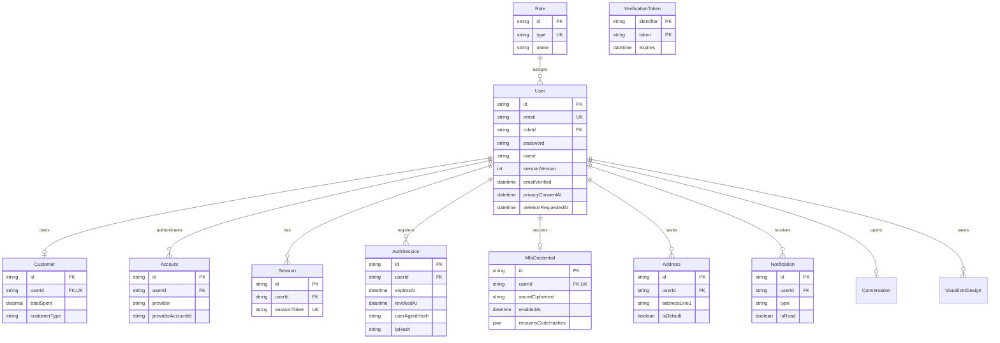
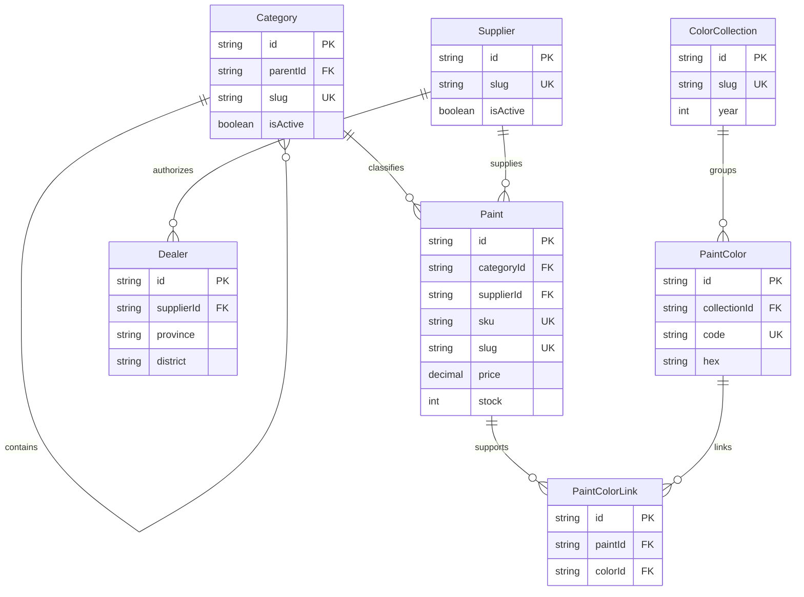
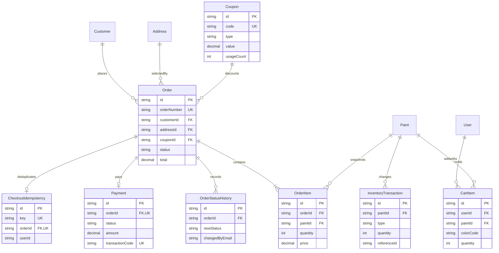
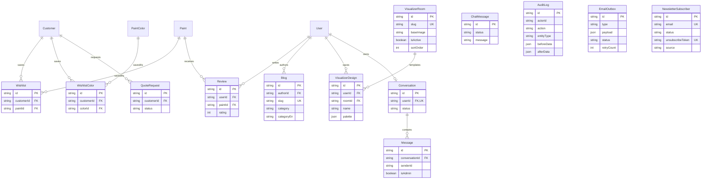

# Maison de FLOF ERD

Last synchronized with `prisma/schema.prisma`: 26/07/2026 (38 models, 12 enums, 15 migrations)

`public/erd_diagram.png` is a historical image and is not an authoritative
schema reference. It omits current models, duplicates `Paint`, and uses key
types that do not match Prisma. This Mermaid source and
`codex_project_audit_pack/DATA_DICTIONARY.md` are the maintained references.

## Identity and customer

## Catalog

## Commerce

## Engagement and operations

## Intentional weak references

- `AuditLog.actorId` is not a foreign key so audit history survives user
  deletion.
- `InventoryTransaction.referenceId` is a polymorphic operational reference,
  not a database foreign key.
- `Message.senderId` is retained as an identifier but has no Prisma relation.
- `ChatMessage` is the guest/legacy support flow; `Conversation` and `Message`
  are the authenticated flow.
- `AuthSession` is the revocable application session registry; `Session` is
  retained for Auth.js database-adapter compatibility.
- `MfaCredential.secretCiphertext` and recovery hashes are never rendered in
  audit/export responses.
- `CartItem` is the server-side mirror for multi-device cart sync. Its uniqueness
  key `(userId, paintId, colorCode)` uses an empty string — not NULL — for the
  "no colour" case, because Postgres treats NULLs as distinct and would allow
  duplicate rows.
- `NewsletterSubscriber` is standalone (no relation to `User`): a subscriber is
  keyed by email and can exist without an account. `unsubscribeToken` is stored
  to back a future one-click unsubscribe link (the consuming endpoint is not yet
  built) and is never the primary id.
